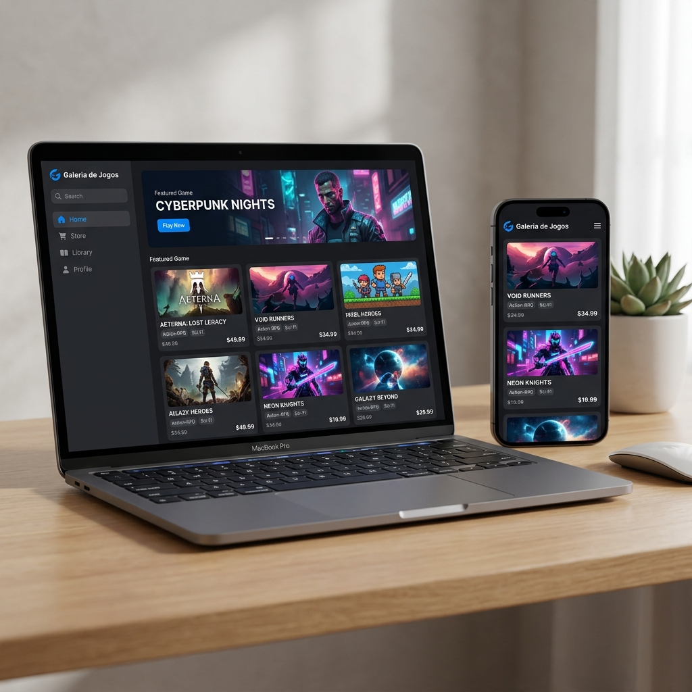

# 🎮 Galeria de Jogos Oficial

Uma plataforma premium para explorar, avaliar e gerenciar jogos digitais, com um design moderno e elegante inspirado na Steam.

<div align="center">
  
  <br />
  
  [](https://react.dev/)
  [](https://vite.dev/)
  [](https://tailwindcss.com/)
  [](https://reactrouter.com/)
</div>

---

## 📱 Visualização do Projeto

Abaixo, veja a interface do projeto rodando perfeitamente tanto em computadores quanto em dispositivos móveis graças à sua responsividade premium:

<div align="center">
  
</div>

---

## ⚙️ Funcionalidades Principais

- **🛍️ Vitrine de Jogos:** Navegue por uma ampla lista de jogos, visualizando capas, preços, gêneros, notas médias e avaliações.
- **🔍 Filtro por Gênero e Busca:** Encontre qualquer jogo rapidamente pesquisando pelo título ou filtrando por tags de gênero (Ação, RPG, Aventura, etc.).
- **🛒 Carrinho de Compras:** Adicione jogos ao seu carrinho de compras e acompanhe o total acumulado antes de fechar a compra.
- **🔐 Autenticação Completa:** Telas para login e de primeiro acesso integrado com token JWT salvo no localStorage para autenticar a sessão do usuário.
- **📚 Biblioteca de Jogos (Restrito):** Acesse uma área restrita e segura com os jogos que pertencem à sua conta.
- **🛡️ Painel do Estúdio (Restrito):** Área reservada para criadores adicionarem novos jogos, editarem informações ou removerem jogos da vitrine.
- **⭐ Sistema de Avaliações e Wishlist:** Adicione jogos aos favoritos e escreva críticas detalhadas com atribuição de notas.
- **🎨 Visual Moderno (Estilo Steam):** Interface imersiva construída com tons de azul e cinza escuro, realce azul claro brilhante, scrollbars customizados e animações suaves de transição.

---

## 🛠️ Tecnologias Utilizadas

Este projeto foi construído utilizando tecnologias modernas do ecossistema front-end:

- **[React 19](https://react.dev/)** - Biblioteca padrão para componentização da interface e gerenciamento de estado.
- **[Vite 8](https://vite.dev/)** - Ferramenta de build e servidor de desenvolvimento ágil com HMR rápido.
- **[Tailwind CSS v4](https://tailwindcss.com/)** - Estilização moderna baseada em utilitários diretamente no arquivo de estilos.
- **[React Router DOM 7](https://reactrouter.com/)** - Roteamento declarativo de páginas e proteção de rotas privadas.
- **[PostCSS](https://postcss.org/)** - Pré-processador de estilos que estende e otimiza as declarações do Tailwind CSS.

---

## 🚀 Como Rodar o Projeto Passo a Passo

Siga os passos abaixo para configurar e rodar o projeto localmente na sua máquina.

### Pré-requisitos

Certifique-se de ter instalado em seu computador:
1. **Node.js** (versão 18.0.0 ou superior). [Baixar Node.js](https://nodejs.org/)
2. Gerenciador de pacotes **NPM** (instalado automaticamente junto ao Node.js).
3. **Git** para clonar o projeto (opcional).

---

### Passo 1: Obter o código do projeto

Se você tem o **Git** configurado, abra o seu terminal e rode o comando:

```bash
git clone https://github.com/luizgustavodeoliveira/galeria-de-jogos-oficial.git
```

Depois, entre na pasta criada:

```bash
cd galeria-de-jogos-oficial
```

*(Se você baixou em formato `.zip`, basta extraí-lo em uma pasta e abrir o terminal ou prompt de comando dentro dela).*

---

### Passo 2: Instalar as dependências do projeto

Para baixar e configurar todas as bibliotecas do projeto (como React, React Router e Tailwind CSS), execute:

```bash
npm install
```

*Isso lerá o arquivo `package.json` e criará o diretório `node_modules` com todos os pacotes.*

---

### Passo 3: Rodar o servidor de desenvolvimento

Com todas as dependências instaladas, inicie o servidor de desenvolvimento do Vite com o comando:

```bash
npm run dev
```

Você verá uma saída no terminal informando que o projeto está rodando. Abra o seu navegador e acesse o endereço indicado:
👉 **`http://localhost:5173`**

*(Qualquer alteração feita nos arquivos do projeto será refletida no seu navegador imediatamente, sem precisar reiniciar o servidor).*

---

### Passo 4: Build para Produção (Opcional)

Se quiser empacotar o projeto em arquivos otimizados e minificados prontos para deploy, execute:

```bash
npm run build
```

Os arquivos finais serão gerados dentro da pasta `dist/`. Para testar localmente como ficou o build final de produção, rode:

```bash
npm run preview
```

---

### Passo 5: Deploy (Opcional)

O projeto conta com o pacote `gh-pages` configurado. Para implantar a sua versão atualizada diretamente no GitHub Pages, basta rodar:

```bash
npm run deploy
```

---

## 📁 Estrutura de Pastas Simplificada

Conheça os principais diretórios para se localizar no código:

```text
galeria-de-jogos-oficial/
├── assets/                  # Imagens e mockups da documentação (ex: mockup.png)
├── src/
│   ├── assets/              # Logo e imagens estáticas consumidas na interface
│   ├── components/          # Componentes globais (Navbar, Footer, FiltroGeneros, etc.)
│   ├── contexts/            # Contextos React para estado compartilhado (ex: CartContext)
│   ├── pages/               # Páginas completas (Vitrine, DetalhesJogo, Login, Carrinho, Biblioteca, Estudio)
│   ├── services/            # Serviços de integração (api.js que consome a API do Railway)
│   ├── App.jsx              # Componente principal e definição das rotas do projeto
│   ├── index.css            # Estilos globais e importações do Tailwind CSS v4
│   └── main.jsx             # Ponto de inicialização do React
├── index.html               # Estrutura base da página web
├── package.json             # Gerenciamento de scripts e dependências do Node.js
└── vite.config.js           # Arquivo de configurações do Vite
```

---

## 🔐 Áreas Restritas e Testes

A API de dados do projeto está em execução no link:
`https://alunos-ads-api-production.up.railway.app`

Para testar as áreas restritas de **Biblioteca** e **Estúdio**:
1. Clique no botão de **Login** no topo da página.
2. Insira a sua matrícula e senha (ou crie um novo cadastro na aba de *Primeiro Acesso*).
3. Após o login bem-sucedido, os menus correspondentes aparecerão automaticamente no cabeçalho.

---

<div align="center">
  <p>Desenvolvido com 💙 para a Galeria de Jogos Oficial</p>
</div>
